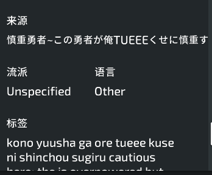

### 1.字体
*   对于lazer的中文字体来说，处理时应注意以下几点
    *   标准文字字体字号应在*18*-*20*之间, 最佳字号*19*, 超过*20*或低于*17*可能会影响观感
    *   各种Overlay大标题字体应在*30*号(Profile,Multi,Beatmap等)
    *   目前粗体、斜体对中文不管用
    *   特殊情况
        *   各种Tab最好用18号字体
        *   对于[*DirectGridPanel*](osu.Game/Overlays/Direct/DirectGridPanel.cs)等显示空间较小的
        类型，在保持文本 ***清晰可见*** 的情况下寻找最小字体,目前的字体为*17*号
        *   右键菜单最好用*17*号字
        *   HeaderDownloadButton的"带视频/不带视频"保持在15号字
        *   谱面在线信息
            *   来源、流派的内容保持在*12*号以避免显示问题:
            

### 2.文本
*   翻译时注意以下几点:
    *   翻译文本是否会与所处环境产生违和感

*仍在补充中*